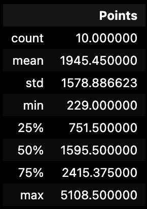

# Danish Maknojia Individual Project 1

## Video Project Description

[Click Here](https://youtu.be/OsskO7cMh14?si=klrGCvgQLxxXarDb)

## Objectives
The project structure must include the following files:
Jupyter Notebook with: 

--Cells that perform descriptive statistics using Polars or Pandas.

--Tested by using nbval plugin for pytest

Makefile with the following:

--Run all tests (must test notebook and script and lib)

--Formats code with Python blackLinks to an external site.

--Lints code with RuffLinks to an external site.

--Installs code via:  pip install -r requirements.txt

--test_script.py to test script

--test_lib.py to test library

--Pinned requirements.txt

--Gitlab Actions performs all four Makefile commands with badges for each one in the README.md

## Directory Structure

## Data Set

- Formula1_2023season_drivers.csv is a dataset with the career driver statistics up to 2023 for active F1 drivers

## Project Content

- The project contains the main file, which opens Formula1_2023season_drivers.csv, groups the data by team & country, and sorts in ascending order. Next, a summary of statistics (for team and points) is generated containing the mean, median (50%) & standard deviation, and three graphs are generated: one bar chart, the second a scatter graph, and a map plot showing the country with the most driver points.

## Summary Statistics

## Bar Chart

## Scatter Plot

## Map Plot

